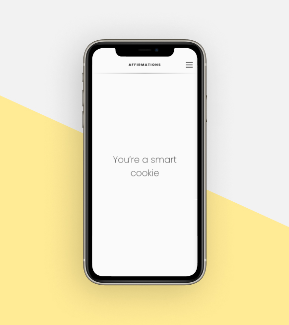

<!-- # affirmations-vite -->

<!-- This project is a rebuild of my original Affirmations project here in Github. -->

<!-- This build includes Vite unlike the previous one. -->

<!-- ALL-CONTRIBUTORS-BADGE:START - Do not remove or modify this section -->

[](#contributors-)

<!-- ALL-CONTRIBUTORS-BADGE:END -->
<p align="center">
    
<p/>

<h4 align="center">This application gives you an editable slideshow of affirmations for your inspirational viewing pleasure. Keep yourself inspired!</h4>
<br>
<p align="center">
<a href="https://github.com/bretpeters3n/affirmations-vite/blob/master/LICENSE" target="blank">

</a>
<a href="https://github.com/bretpeters3n/affirmations-vite/fork" target="blank">

</a>
<a href="https://github.com/bretpeters3n/affirmations-vite/stargazers" target="blank">

</a>
<a href="https://github.com/bretpeters3n/affirmations-vite/issues" target="blank">

</a>
<a href="https://github.com/bretpeters3n/affirmations-vite/pulls" target="blank">

</a>
</p>

<p align="center">
    <a href="https://github.com/bretpeters3n/affirmations-vite/issues/new/choose">Report Bug</a>
    ·
    <a href="https://github.com/bretpeters3n/affirmations-vite/issues/new/choose">Request Feature</a>
</p>

# 👋 Introducing `Affirmations`

<p align="center">
    <a href="https://Budgety.vercel.app" target="blank"/>
        
    </a>
</p>

`Budgety` is an opensource platform to create and share affirmations with an easy-to-use interface. You can create affirmation groups and share them with your friends. You can also create a slideshow of affirmations to help you stay motivated.

# 🔥 Features

`Budgety` comes with a bundle of features already. You can do the followings with it:

## 🏗️ Add, Edit, Erase, and Save

- Users can feel free to add your own affirmations, edit existing ones, erase them all to start from scratch, and load in the default affirmations that you started with.

## 🤝 Share

- Users can share their affirmations with friends and family.

## 📱 Slideshow

- Users can create a slideshow of their affirmations to help them stay motivated.

1. Clone the repository

```sh
git clone https://github.com/bretpeters3n/affirmations-vite.git
```

2. Change the working directory

```bash
cd affirmations-vite
```

3. Install dependencies

```bash
npm install
```

4. Start running the frontend

```bash
npm run dev
```

That's All!!! Now open [localhost:5173/affirmations-vite/](http://localhost:5173/affirmations-vite/) (unless your port is different) to see the app.

# 🍔 Built With

<!-- React, Vite, MUI, Framer Motion, UUID, Toastify, Bootstrap, and GitHub Pages-->

1. devDependencies

- [@vitejs/plugin-react](https://www.npmjs.com/package/@vitejs/plugin-react): The default Vite plugin for React projects.
- [eslint](https://www.npmjs.com/package/eslint): ESLint is a tool for identifying and reporting on patterns found in ECMAScript/JavaScript code.
- [eslint-config-prettier](https://www.npmjs.com/package/eslint-config-prettier): Turns off all rules that are unnecessary or might conflict with Prettier.
- [eslint-plugin-import](https://www.npmjs.com/package/eslint-plugin-import): This plugin intends to support linting of ES2015+ (ES6+) import/export syntax, and prevent issues with misspelling of file paths and import names.
- [eslint-plugin-jsx-a11y](https://www.npmjs.com/package/eslint-plugin-jsx-a11y): Static AST checker for accessibility rules on JSX elements.
- [eslint-plugin-react](https://www.npmjs.com/package/eslint-plugin-react): React specific linting rules for eslint.
- [eslint-plugin-react](https://www.npmjs.com/package/gh-pages): Publish files to a gh-pages branch on GitHub (or any other branch anywhere else).
- [eslint-plugin-react](https://www.npmjs.com/package/prettier): Prettier is an opinionated code formatter. It enforces a consistent style by parsing your code and re-printing it with its own rules that take the maximum line length into account, wrapping code when necessary.
- [vite](https://www.npmjs.com/package/vite): Next Generation Frontend Tooling

2. dependencies

- [@emotion/react](https://www.npmjs.com/package/@emotion/react): Simple styling in React.
- [@emotion/styled](https://www.npmjs.com/package/@emotion/styled): The styled API for @emotion/react
- [@mui/icons-material](https://www.npmjs.com/package/@mui/icons-material): This package provides the Google Material Icons converted to SvgIcon components.
- [@mui/material](https://www.npmjs.com/package/@mui/material): Material UI is an open-source React component library that implements Google's Material Design.
- [@splidejs/react-splide](https://www.npmjs.com/package/@splidejs/react-splide): React Splide is the React component for the Splide slider/carousel.
- [dotenv](https://www.npmjs.com/package/dotenv): Dotenv is a zero-dependency module that loads environment variables from a .env file into process.env.
- [express](https://www.npmjs.com/package/express): Fast, unopinionated, minimalist web framework for Node.js.
- [framer-motion](https://www.npmjs.com/package/framer-motion): An open source motion library for React, made by Framer.
- [react](https://www.npmjs.com/package/react): React is a JavaScript library for creating user interfaces.
- [react-bootstrap](https://www.npmjs.com/package/react-bootstrap): Bootstrap 5 components built with React.
- [react-dom](https://www.npmjs.com/package/react-dom): This package serves as the entry point to the DOM and server renderers for React.
- [react-icons](https://www.npmjs.com/package/react-icons): Include popular icons in your React projects easily with react-icons, which utilizes ES6 imports that allows you to include only the icons that your project is using.
- [react-router-dom](https://www.npmjs.com/package/react-router-dom): This package serves as the entry point to the DOM and server renderers for React.
- [react-toastify](https://www.npmjs.com/package/react-toastify): React-Toastify allows you to add notifications to your app with ease. No more nonsense!
- [short-unique-id](https://www.npmjs.com/package/short-unique-id): Tiny (6.7kB minified) no-dependency library for generating random or sequential UUID of any length with exceptionally minuscule probabilies of duplicate IDs.
- [styled-components](https://www.npmjs.com/package/styled-components): Visual primitives for the component age. Use the best bits of ES6 and CSS to style your apps without stress.

# 🛡️ License

This project is licensed under the MIT License - see the [`LICENSE`](LICENSE) file for details.

# 🦄 Upcoming Features

`Budgety` has all the potential to grow further. Here are some of the upcoming features planned(not in any order),

- ✔️ Create API for affirmation stock groups a User can load into their slideshow
- ✔️ Add a database so the User doesn't have to rely on localStorage to run this project
- ✔️ Allow for reorganization of affirmation within User slideshow groups
